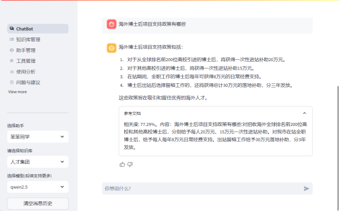
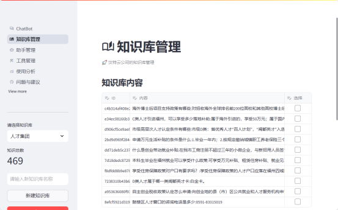
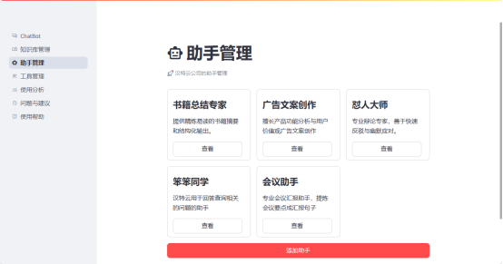
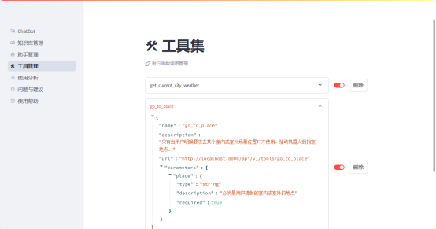
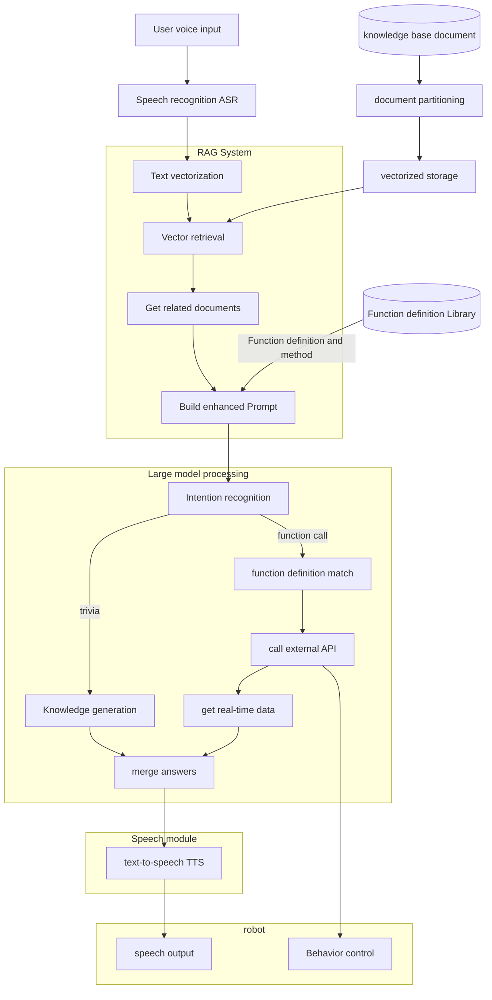

([简体中文](./README_zh.md)|English)

## Overview

With the rapid development of artificial intelligence and large model technology, it can bring significant changes to all walks of life, and robots are highly dependent on intelligence, and the improvement brought by large models is huge. For example, voice interaction, as an important way of human-computer interaction, can provide a more natural and efficient interactive experience. The use of large models and RAG (Retrieval Augmented Generation) technology can improve the robot's ability in knowledge base retrieval and task control, and achieve more intelligent services

Web UI Demo Screenshot:









## Install

- Precondition:

  Pull projects from github

```shell
git pull https://github.com/huxiaolongyin/Chat2RAG
```

  Configure the.env file

```shell
cp .env.example .env
vi.env
```

### Method 1: Install from source code

- Requirements (Creating a virtual environment is strongly recommended)

```shell
python >=3.9
```

- Install the qdrant vector database

```shell
docker run -d --name qdrant -p 6333:6333 -p 6334:6334 qdrant/qdrant:latest
```

- Install via pyproject.toml

```shell
pip install .
```

### Method 2: Install using docker

- Build backend docker images

```shell
docker build -t chat2rag-backend:latest . -f docker/backend.Dockerfile
```

- Build frontend docker images

```shell
docker build -t chat2rag-frontend:latest . -f docker/frontend.Dockerfile
```

- Install through docker compose

```shell
cd docker
docker compose up -d
```

## Quick start

- Start by script

```shell
streamlit run frontend/app.py
```

- Open a web page [http://127.0.0.1:8501](http://127.0.0.1:8501)

## Document

### Features

* **Knowledge base retrieval** : It can retrieve information quickly and accurately from the huge knowledge base and answer users' questions.
* **Function call**: According to the user's instructions, perform the corresponding tasks, such as equipment control, scheduling, etc.

todo

* **Voice interaction**: Support natural language voice input and output, to achieve human and machine voice dialogue.
* **Self-learning** : Constantly optimize your understanding and responsiveness through interaction.

### Core processes and principles



Key steps in the flow chart:

1.**Speech input processing phase**

* Collect the user's voice signal and perform noise reduction preprocessing
* ASRThe model converts speech to text

2. **Retrieval Stage: **

* The text is converted to a vector representation by an embedding model
* Convert knowledge base documents to vector storage
* Vectorization of user-entered questions
* Use vector similarity search to find the most relevant pieces of document

3. **Enhancement Phase**

* Use the retrieved related documents as context
* Combine user questions and related documents into prompts
* Add the necessary directives and constraints

- Provide large language models as a knowledge supplement

4. **Large Model Processing Stage**

* Intent Recognition: Analyze user intent (quizzes/instruction execution)
* Knowledge Generation: Generate answers based on RAG results
* Function call: Match the predefined function and call the external API
* Result consolidation: Integrate knowledge base information and real-time data

5. Knowledge Base Management

* Document Chunking: Divide the content of the document reasonably
* Vectorization: Vectors are generated using the embedding model
* Index Building: Establish efficient vector retrieval indexes

6. Function Registration Management

* Maintain standardized function definitions
* Support dynamic function registration
* Provide permission control for function calls

7. **Output Processing Phase**

* Text-to-speech: Generate natural speech using TTS models
* Behavior Control: Execute robot action commands
* Multimodal Output: Coordinates voice and behavior outputs

This system solution realizes a complete closed loop from voice input to multimodal output, enhances the accuracy and practicability of answers through RAG technology and function calls, and uses the open-source **Haystack** on the framework, compared with the more well-known Langchain:

- Support expansion and customization, with stronger pipeline modularity, and components can be used independently;
- Support document processing and indexing, and have stronger support for documents;
- Easier to learn, compared to Lanchain's complex framework, Haystack is simpler and more efficient, and the official documentation is more intuitive and clearly structured;

## Refer to the documentation

- Fastgpt: https://github.com/labring/FastGPT
- ollama: https://github.com/ollama/ollama
- langchain: https://github.com/langchain-ai/langchain
- taskingAI: https://github.com/TaskingAI/TaskingAI
