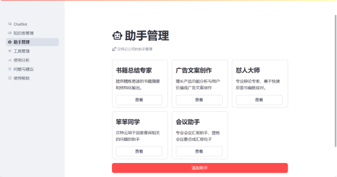

简体中文|[English](./README.md))

## 概述

随着人工智能和大模型技术的快速发展，能够给各行各业带来显著的变革，而机器人更是高度依赖智能化，大模型所带来的提升更是巨大的。例如，语音交互作为人机交互的重要方式，能够提供更自然和高效的交互体验。利用大模型和RAG（Retrieval-Augmented Generation，检索增强生成）技术，可以提升机器人在知识库检索和任务控制方面的能力，实现更智能化的服务。

Web UI Demo 截图：





## 安装

- 前置条件：

  从 github 上进行拉取项目

```shell
git pull https://github.com/huxiaolongyin/Chat2RAG
```

    配置 .env 文件

```shell
cp .env.example .env
vi .env
```

### 方法一：从源代码进行安装

- 要求(强烈建议创建虚拟环境)

```shell
python >= 3.9
```

- 步骤1：安装 qdrant 向量数据库

```shell
docker run -d --name qdrant -p 6333:6333 -p 6334:6334 qdrant/qdrant:latest
```

- 步骤2：安装 web 所需依赖

```shell
pip install -r frontend/requirements.txt
```

- 步骤3：通过 pyproject.toml 进行安装

```shell
pip install .
```

- 步骤4：启动服务

```shell
# 后端服务
python backend/main.py
# 前端页面
streamlit run frontend/app.py
```

### 方法二：通过 docker 进行安装

- 通过 docker-compose 进行安装

```shell
docker compose -f docker/docker-compose.yml up -d
```

## 快速开始

- 打开网页 [http://127.0.0.1:8501](http://127.0.0.1:8501)

## 文档

### 特征

* **知识库检索** ：能够从庞大的知识库中快速准确地检索信息，回答用户的问题。
* **函数调用**：根据用户的指令，执行相应的任务，如设备控制、日程安排等。

todo

* **语音交互** ：支持自然语言的语音输入和输出，实现人与机器的语音对话。
* **自我学习** ：通过交互，不断优化自身理解和响应能力。

### 核心流程和原理


流程图关键步骤：

1. **语音输入处理阶段**

* 采集用户语音信号并进行降噪预处理
* ASR模型将语音转换为文本

2. **检索阶段：**

* 文本经过 embedding 模型转换为向量表示
* 将知识库文档转换为向量形式存储
* 对用户输入的问题进行向量化
* 使用向量相似度搜索找出最相关的文档片段

3. **增强阶段**

* 将检索到的相关文档作为上下文
* 把用户问题和相关文档组合成提示词(Prompt)
* 添加必要的指令和约束条件
* 提供给大语言模型作为知识补充

4. **大模型处理阶段**

* 意图识别：分析用户意图(知识问答/指令执行)
* 知识生成：基于RAG结果生成回答
* 函数调用：匹配预定义函数，调用外部API
* 结果合并：整合知识库信息和实时数据

5. **知识库管理**

* 文档分块：合理切分文档内容
* 向量化：使用embedding模型生成向量
* 索引构建：建立高效的向量检索索引

6. **函数注册管理**

* 维护标准化的函数定义
* 支持动态函数注册
* 提供函数调用的权限控制

7. **输出处理阶段**

* 文本转语音：使用TTS模型生成自然语音
* 行为控制：执行机器人动作指令
* 多模态输出：协调语音和行为输出

  此系统方案实现了从语音输入到多模态输出的完整闭环，通过RAG技术和函数调用增强了回答的准确性和实用性，在框架上使用开源的 **Haystack** ，相较于比较知名的 Langchain：

- 支持扩展和定制，拥有更强的 Pipeline 模块化能力，组件可独立使用;
- 支持文档处理和索引，对于文档有更强的支持;
- 更易于学习，相较于 Lanchain 复杂的框架，Haystack 更加简单高效，在官方的文档也更直观，文档结构清晰;

## 参考文档

- Fastgpt：https://github.com/labring/FastGPT
- ollama：https://github.com/ollama/ollama
- langchain：https://github.com/langchain-ai/langchain
- taskingAI：https://github.com/TaskingAI/TaskingAI
